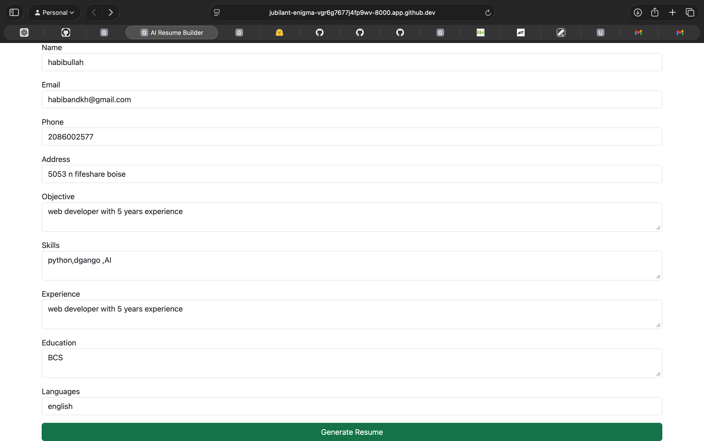
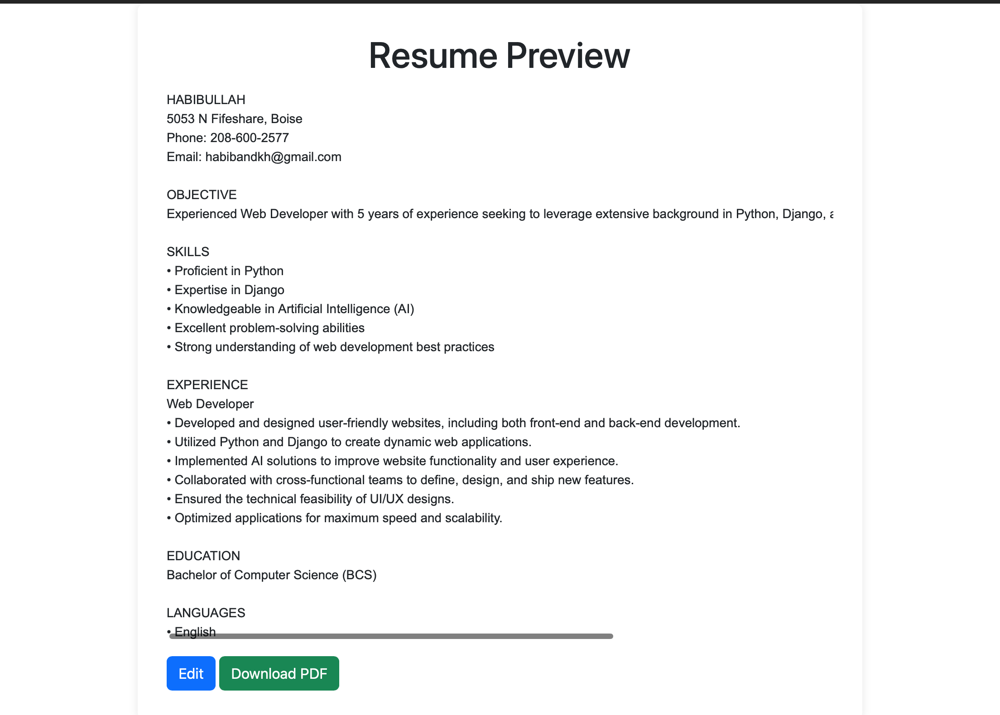

# AI Resume Builder (Django)

A professional AI-powered resume builder built with Django and OpenAI.  
Users can fill a form, generate a resume in a professional format, and download it as PDF.

---

## Features
- User-friendly form to input name, age, experience, skills, education
- Generates a **professional USA-style resume**
- Preview the resume before downloading
- Download resume as PDF
- AI-powered resume text generation

---

## Screenshots

**Form Input:**  


**Resume Preview:**  


---

## Getting Started (Local Setup)

### Prerequisites
- Python 3.10+
- Git

### Installation
```bash
# Clone the repository
git clone https://github.com/habib-phd/resume-ai-builder_Django.git
cd resume-ai-builder_Django

# Create virtual environment
python -m venv venv
source venv/bin/activate  # Linux/macOS
venv\Scripts\activate     # Windows

# Install dependencies
pip install -r requirements.txt

# Set your OpenAI API key
export OPENAI_API_KEY="YOUR_API_KEY"  # Linux/macOS
setx OPENAI_API_KEY "YOUR_API_KEY"    # Windows

# Run Django migrations
python manage.py migrate

# Start the server
python manage.py runserver
